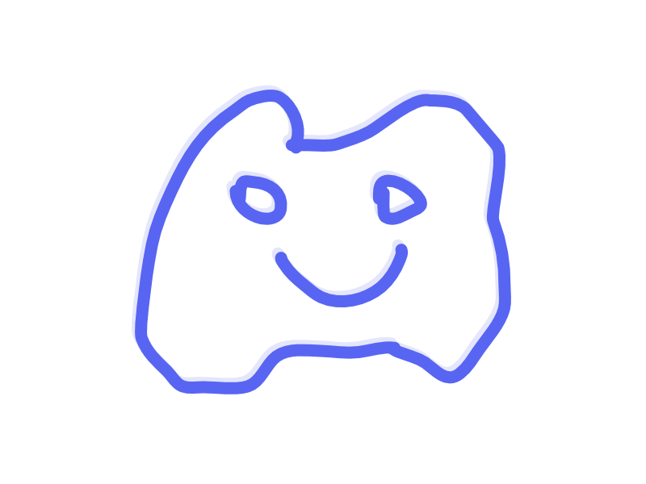

<!-- PROJECT SHIELDS -->
[![Contributors][contributors-shield]][contributors-url]
[![Forks][forks-shield]][forks-url]
[![Stargazers][stars-shield]][stars-url]
[![Issues][issues-shield]][issues-url]
[![MIT License][license-shield]][license-url]

<!-- PROJECT LOGO -->
<br />
<div align="center">
  <a href="https://github.com/noahgerard/discord-bot-boilerplate">
    
  </a>

  <h3 align="center">Discord Bot Boilerplate</h3>

  <p align="center">
    Simple and easy to use discord bot boilerplate written in typescript!
    <br />
    <a href="https://github.com/noahgerard/discord-bot-boilerplate/issues/new?labels=bug&template=bug-report---.md">Report Bug</a>
    ·
    <a href="https://github.com/noahgerard/discord-bot-boilerplate/issues/new?labels=enhancement&template=feature-request---.md">Request Feature</a>
  </p>
</div>

<!-- ABOUT THE PROJECT -->
## About The Project

I've been making discord bots for quite a while, and I found it annoying having to set up a new project quickly. So I decided to make this simple boilerplate to make it easier for me to get started on new projects. I hope you find it useful too!

### Built With
* [![Discord.js][Discord.js]][Discord-url]
* [![Prisma][Prisma]][Prisma-url]
* [![CommandKit][CommandKit]][CommandKit-url]

<!-- GETTING STARTED -->
## Getting Started

This is an example of how you may give instructions on setting up your project locally.
To get a local copy up and running follow these simple example steps.

### Prerequisites

This is an example of how to list things you need to use the software and how to install them.
* npm
  ```sh
  npm install npm@latest -g
  ```

### Installation

1. Clone the repo
   ```sh
   git clone https://github.com/noahgerard/discord-bot-boilerplate.git
   ```
2. Install NPM packages
   ```sh
   npm install
   ```
3. Create a `.env` file in the root directory and add the following:
   ```sh
	PRISMA_DATABASE_URL=""
	BOT_TOKEN=""
	APP_ID=""
   ```

<!-- ROADMAP -->
## Roadmap

- [ ] Add more basic commands
- [ ] Add more database helper functions
- [ ] Add more cusotmizable validators
- [ ] Full sharding support

See the [open issues](https://github.com/noahgerard/discord-bot-boilerplate/issues) for a full list of proposed features (and known issues).

<!-- CONTRIBUTING -->
## Contributing

Contributions are what make the open source community such an amazing place to learn, inspire, and create. Any contributions you make are **greatly appreciated**.

If you have a suggestion that would make this better, please fork the repo and create a pull request. You can also simply open an issue with the tag "enhancement".
Don't forget to give the project a star! Thanks again!

1. Fork the Project
2. Create your Feature Branch (`git checkout -b feature/AmazingFeature`)
3. Commit your Changes (`git commit -m 'Add some AmazingFeature'`)
4. Push to the Branch (`git push origin feature/AmazingFeature`)
5. Open a Pull Request

<!-- LICENSE -->
## License

Distributed under the MIT License. See `LICENSE.txt` for more information.

<!-- MARKDOWN LINKS & IMAGES -->
<!-- https://www.markdownguide.org/basic-syntax/#reference-style-links -->
[contributors-shield]: https://img.shields.io/github/contributors/noahgerard/discord-bot-boilerplate.svg?style=for-the-badge
[contributors-url]: https://github.com/noahgerard/discord-bot-boilerplate/graphs/contributors
[forks-shield]: https://img.shields.io/github/forks/noahgerard/discord-bot-boilerplate.svg?style=for-the-badge
[forks-url]: https://github.com/noahgerard/discord-bot-boilerplate/network/members
[stars-shield]: https://img.shields.io/github/stars/noahgerard/discord-bot-boilerplate.svg?style=for-the-badge
[stars-url]: https://github.com/noahgerard/discord-bot-boilerplate/stargazers
[issues-shield]: https://img.shields.io/github/issues/noahgerard/discord-bot-boilerplate.svg?style=for-the-badge
[issues-url]: https://github.com/noahgerard/discord-bot-boilerplate/issues
[license-shield]: https://img.shields.io/github/license/noahgerard/discord-bot-boilerplate.svg?style=for-the-badge
[license-url]: https://github.com/noahgerard/discord-bot-boilerplate/blob/master/LICENSE.txt
[linkedin-shield]: https://img.shields.io/badge/-LinkedIn-black.svg?style=for-the-badge&logo=linkedin&colorB=555
[product-screenshot]: images/screenshot.png

[Discord.js]: https://img.shields.io/badge/Discord.js-5865F2?style=for-the-badge&logo=discord&logoColor=white
[Discord-url]: https://discord.js.org/
[CommandKit]: https://img.shields.io/badge/CommandKit-5865F2?style=for-the-badge&logo=discord&logoColor=white
[CommandKit-url]: https://commandkit.js.org/
[Prisma]: https://img.shields.io/badge/Prisma-2D3748?style=for-the-badge&logo=prisma&logoColor=white
[Prisma-url]: https://prisma.io